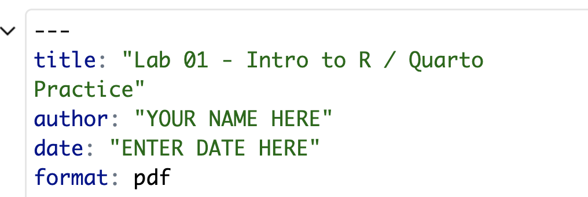

## Thursday announcements

-   First quiz to start class today (\~5mins). Closed book, closed notes.

-   HW 01, Lab 01, Annotations 02 due tonight

    -   html -\> zip still fine for Lab 01 submission

    -   make sure you can render to pdf before Lab 02 due date

    -   see Piazza announcement for more details/help and/or come to student hours!

-   RE: Exam 1 takehome/Parents' weekend conflict. Will keep the same date, but will keep the take-home length reasonable (no more time than regular homework assignment), and will allow 2-day extension if needed.

## Tuesday announcements

-   First in-class quiz will be on Thursday. Closed book, closed notes.

-   HW 01 & Lab 01 due Thursday 11:59pm

    -   Blackboard doesn't like html submissions. Zip files are fine for Lab 01, pdf will be best moving forward
    -   To render to a pdf, add format: pdf to your YAML (top section between the three dashes in the .qmd)
        -   

## What to put on your attendance notecard

-   Name
-   Date
-   (OPTIONAL) What was the "muddiest point" from today's class? I.e., what was confusing or unclear during today's class? What are you still grappling with?
-   (OPTIONAL) Is there anything going on in your life that you'd like me to know about? E.g., anxiety, upcoming interview, illness in the family, etc. {: .fs-5 }
