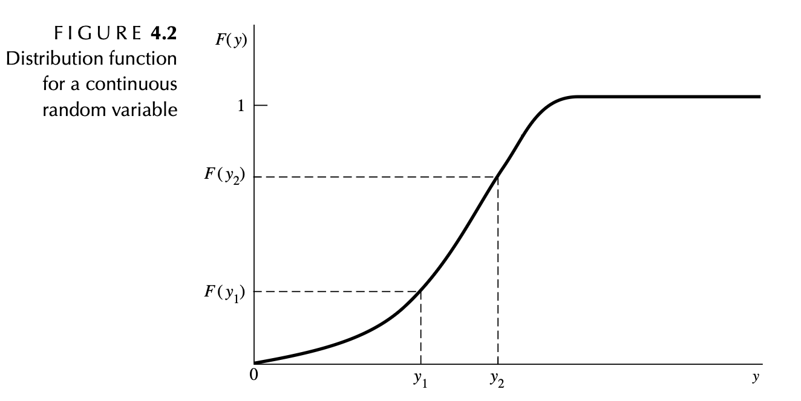

```{r, echo = FALSE, message=FALSE, warning = FALSE}
library(tidyverse)
library(gridExtra)
library(cowplot)
```

```{r, echo = FALSE, message = FALSE, warning = FALSE}
library(tidyverse)
library(gridExtra)
```

\pagebreak

# 4.2 Continuous Random Variables

### Discrete vs. Continuous

So far we have worked with **discrete** random variables that have
probability distributions $$\sum_S p(y) = 1$$ In this chapter we will
consider **continuous** random variables that have **probability density
functions** (pdfs) $$\int_S f(y)dy = 1$$

Discrete random variables have a finite or countably infinite set of
possible outcomes:

-   Uniform (m-sided die): {1,2, ..., m}
-   Bernoulli (success/failure): {0,1}
-   Binomial (\# of successes in n trials): {0, 1, ... n}
-   Geometric (\# of trials until 1st success): $\{1, 2, \dots\}$
-   Negative Binomial (\# of trials until rth success):
    $\{r, r + 1, r + 2, \dots\}$
-   Hypergeometric (\# of successes when sampling without replacement
    from finite population): {0, 1, 2, ... r}
-   Poisson (\# of occurances in unit interval) $\{1, 2, \dots\}$

**Continuous** random variables, on the other hand, have an *interval*
of possible outcomes, and decimal values are possible:

-   amount of rain, in inches, that falls in a randomly selected storm
-   weight, in pounds, of a randomly selected student
-   square footage of a randomly selected house

The set of possible measurements in a continuous interval is (not
countably) infinite and can't be put on a one-to-one correspondence with
the integers.

::: {.activitybox data-latex=""}
The probability that a continuous random variable $Y$ takes on any
particular value is 0, so we won't be finding $P(Y = y)$ for continuous
random variables, but rather, $P(a < Y < b)$.
:::

```{r, echo = FALSE, out.width="80%", out.height = "20%", fig.align="center"}
knitr::include_graphics("./images/continuous_rv.png")
```

\pagebreak

### Recall: cumulative distribution functions (cdfs)

::: {.highlightbox data-latex=""}
$$F(y) = P(Y \leq y), \ \ \ -\infty<y<\infty$$

is called the
\textcolor{red}{\textbf{cumulative distribution function (cdf)}} of a
random variable $Y$.
:::

{width="324"}

::: {.highlightbox data-latex=""}
**Theorem 4.1**: Properties of a cumulative distribution function: If
$F(y)$ is a cdf, then

1.  $F(-\infty) \equiv \displaystyle \lim_{y \to -\infty} F(y) = 0.$

2.  $F(\infty) \equiv \displaystyle \lim_{y \to \infty} F(y) = 1.$

3.  $F(y)$ is a nondecreasing function of $y$. If $y_1 < y_2$, then
    $F(y_1) \leq F(y_2).$
:::

### Properties of continuous pdfs and cdfs

| **Discrete** | **Continuous** |
|----------------------------------|--------------------------------------|
| p(y) = probability distribution | f(y) = probability density function (pdf) |
|  |  |
| $p(y) > 0, y \in S$ | $f(y) \geq 0, y \in S$ |
|  |  |
| $\sum_{y \in S} p(y) = 1$ | $\int_S f(y)dy = 1$ |
|  |  |
| If $A \subset S$, $P(Y \in A) = \sum_{Y \in A}p(y)$ | If $(a,b) \subset S$, $P(a < Y < b) = P(a \leq Y \leq b) = \int_a^bf(y)dy$ |
|  |  |
| cdf: $F(y) = P(Y \leq y)$ | cdf: $F(y) = P(Y \leq y) = \int_{-\infty}^y f(t)dt, -\infty < y < \infty$ |

::: {.highlightbox data-latex=""}
By the **Fundamental Theorem of Calculus**, we have that $F'(y) = f(y)$
for all $y$ values where $F'(y)$ exists, and
$P (a \leq Y \leq b) = F(b) - F(a)$
:::

\pagebreak

# 4.3 Expected value of continuous distributions

Expected value (including mean, variance, and moment generating
functions) have the *same exact* definition for continuous random
variables as they did for discrete random variables. Now, we're just
evaluating them with **integrals** instead of **sums**.

| **Definition** | **Discrete** | **Continuous** |
|----------------------|-------------------------|-------------------------|
| $\mu = E(Y)$ | $\sum_{y \in S}xp(y)$ | $\int_S xf(y)dy$ |
|  |  |  |
| $\sigma^2 = V(Y) = E[(Y - \mu)^2]$ | $\sum_{Y \in S}(y - \mu)^2p(y)$ | $\int_S (y - \mu)^2f(y)dy$ |
|  |  |  |
| $k^{th} \text{ moment =}E(Y^k)$ | $\sum_{y \in S}y^kp(y)$ | $\int_S y^kf(y)dy$ |
|  |  |  |
| $m(t) = E(e^{tY})$ | $\sum_{y \in S}e^{ty}p(y)$ | $\int_S e^{ty}f(y)dy$ |
|  |  |  |
| $E(g(Y))$ | $\sum_{y \in S}g(y)p(y)$ | $\int_S g(y)f(y)dy$ |
|  |  |  |

The following relationships still hold true for continuous random
variables as well:

-   standard deviation = $\sigma = \sqrt{\sigma^2} = \sqrt{V(Y)}$

-   $V(Y) = E(Y^2) - [E(Y)]^2$

-   first moment: $\mu = E(Y) = m'(0)$

-   second moment: $E(Y^2) = m''(0)$

-   $\sigma^2 = V(Y) = m''(0) - [m'(0)]^2$

- $E(cg(Y)) = cE(g(Y))$

- $E[c_1g_1(Y) + c_2g_2(Y)] = c_1E(g_1(Y)) + c_2E(g_2(Y))$

# 4.4 Uniform Distribution (continuous)

::: {.activitybox data-latex=""}
**Example**

Suppose it takes between 0 and 40 seconds for an elevator to arrive once
you have pushed the button. We will assume that all wait times are
equally likely. Define a random variable and determine a pdf to model
this situation. *Hint: draw a picture.*\
\
\
\
\
\
\
\
\
\
\
\
\
\
\
\
\
:::

::: {.activitybox data-latex=""}
**Example**

Let the random variable Y denote the outcome when a point is selected at
random from an interval $[a, b]$, $-\infty < a < b < \infty$. What might
be a reasonable expression for the probability that the point is
selected from the interval $[a,y], \ \ a \leq y\leq b.$ *Hint: draw a
picture.*\
\
\
\
\
\
\
\
\
\
\
\
\
\
\
\
:::

::: {.highlightbox data-latex=""}
The $cdf$ of a
\textcolor{red}{\textbf{continuous uniform random variable}} $Y$ is
given by $$F(y) = \begin{cases}
0, & y < a \\
\frac{y-a}{b-a}, & a \leq y \leq b, \\
1, & b \leq y,
\end{cases}$$

and the $pdf$ of $Y$ is given by
$$f(y) = \frac{1}{b-a}, \ \ \ \ \ a \leq y \leq b.$$
:::

Similar to the discrete case, a random variable $Y$ has a
\textcolor{red}{\textbf{uniform distribution}} if its pdf is equal to a
constant on its support.

However, in the continuous case, the support is a continuous interval
rather than a discrete set of possible values. In the definition on the
previous slide, the support of $Y$ is the interval $[a,b]$.

We write $Y \sim U(a,b),$ to mean $Y$ is a uniform random variable (or
"is uniformly distributed") on the interval $(a,b)$.

::: {.highlightbox data-latex=""}
You will derive the mean, variance, and mgf of the continuous uniform
distribution in the group work.
:::

::: {.activitybox data-latex=""}
**Elevator Example (cont'd)**

Find and graph the cdf for the uniform random variable in the elevator
example. What is the probability that the elevator arrives in less than
10 seconds? Between 15 and 20 seconds?\
\
\
\
\
\
\
\
\
\
\
\
\
\
\
\
\
\
\
\
\
\
\
\

:::

::: {.activitybox data-latex=""}
**Exercise**

Let $Y$ have a uniform distribution $U(0,1)$ (we call this the "standard
uniform distribution").

1.  Write out the pdf and cdf of $Y$

\
\
\
\
\
\

2.  Let $W = a + (b-a)Y, \ \ \ \ \ a < b$ Find the cdf of $W$. How is
    $W$ distributed?\
    \
    \
    \
    \
    \
    \
    \
    \
    \
    \
    \
    \
    \
    \
    \
    \
    \
    \
    \
:::

\pagebreak

## Percentiles

The \textcolor{red}{\textbf{(100p)th percentile}} is a number $\phi_p$,
such that the area under $f(y)$ to the left of $\phi_p$ is $p$. That is,

$$F(\phi_p) = \int_{-\infty}^{\phi_p} f(y)dy = p$$

For example, the figure below illustrates the 30th $(\phi_{0.3})$ and
90th $(\phi_{0.9})$ percentiles.

```{r, eval = FALSE, echo = FALSE, out.width="60%", out.height = "60%", fig.align="center"}
knitr::include_graphics("./images/percentiles.png")
```

```{r, echo = FALSE, out.height = "25%",out.width="80%", fig.align="center", warning=FALSE, message = FALSE}
library(ggplot2)
library(cowplot)
library(grid)  # for arrow()

# Parameters: Weibull(k=3, λ=4)
shape <- 3
scale <- 4

# Generate values
y <- seq(0, 8, length.out = 500)
pdf_vals <- dweibull(y, shape = shape, scale = scale)
cdf_vals <- pweibull(y, shape = shape, scale = scale)

# Percentiles
p1 <- 0.30
p2 <- 0.90
phi_30 <- qweibull(p1, shape = shape, scale = scale)
phi_90 <- qweibull(p2, shape = shape, scale = scale)

# ---- Density plot ----
df_pdf <- data.frame(y = y, f = pdf_vals)

p_pdf <- ggplot(df_pdf, aes(x = y, y = f)) +
  geom_line(color = "steelblue", size = 1) +
  geom_area(data = subset(df_pdf, y <= phi_30), aes(x = y, y = f), 
            fill = "skyblue", alpha = 0.6) +
  geom_area(data = subset(df_pdf, y <= phi_90), aes(x = y, y = f), 
            fill = "skyblue", alpha = 0.3) +
  
  # Vertical lines that stop at curve
  annotate("segment", x = phi_30, xend = phi_30, y = 0, 
           yend = dweibull(phi_30, shape = shape, scale = scale),
           linetype = "solid") +
  annotate("segment", x = phi_90, xend = phi_90, y = 0, 
           yend = dweibull(phi_90, shape = shape, scale = scale),
           linetype = "solid") +
  
  # Annotation for 0.30
  annotate("text", x = 1, y = 0.16, label = "0.30", hjust = 1, vjust = 0) +
  annotate("segment", x = 1, y = 0.16, xend = 2.5, yend = 0.12,
           arrow = arrow(length = unit(0.2,"cm"))) +
  
  # Annotation for 0.90
  annotate("text", x = 1, y = 0.25, label = "0.90", hjust = 1, vjust = 0) +
  annotate("segment", x = 1, y = 0.25, xend = 2.5, yend = 0.18,
           arrow = arrow(length = unit(0.2,"cm"))) +
  annotate("segment", x = 1, y = 0.25, xend = 4, yend = 0.20,
           arrow = arrow(length = unit(0.2,"cm"))) +
  
  # Label phi at axis
  annotate("text", x = phi_30, y = 0, label = expression(phi[0.30]), vjust = 1.2) +
  annotate("text", x = phi_90, y = 0, label = expression(phi[0.90]), vjust = 1.2) +
  
  labs(x = "y", y = "f(y)") +
  theme_minimal(base_size = 14)


# ---- CDF plot ----
df_cdf <- data.frame(y = y, F = cdf_vals)

p_cdf <- ggplot(df_cdf, aes(x = y, y = F)) +
  geom_line(color = "steelblue", size = 1) +
  
  # Horizontal & vertical segments for phi_30
  annotate("segment", x = 0, y = p1, xend = phi_30, yend = p1, linetype = "solid") +
  annotate("segment", x = phi_30, y = 0, xend = phi_30, yend = p1, linetype = "solid") +
  
  # Horizontal & vertical segments for phi_90
  annotate("segment", x = 0, y = p2, xend = phi_90, yend = p2, linetype = "solid") +
  annotate("segment", x = phi_90, y = 0, xend = phi_90, yend = p2, linetype = "solid") +
  
  # Labels at intersections
  annotate("text", 
           x = phi_30, y = p1, 
           label = expression(paste("(", phi[0.30], ", ", 0.3, ")")), 
           hjust = -0.1) +
  annotate("text", 
           x = phi_90, y = p2, 
           label = expression(paste("(", phi[0.90], ", ", 0.90, ")")), 
           hjust = -0.1) +
  
  labs(x = "y", y = "F(y)") +
  theme_minimal(base_size = 14)


# ---- Combine ----
plot_grid(p_pdf, p_cdf, ncol = 2, labels = NULL)

```

The 50th percentile is called the \textcolor{red}{\textbf{median}},
$\phi_{0.50}$. The 25th and 75th percentiles are called the
\textcolor{red}{\textbf{first}} and
\textcolor{red}{\textbf{third quartiles}}, respectively, and are denoted
by $q_1 = \phi_{0.25}$ and $q_3 = \phi_{0.75}$.

::: {.activitybox data-latex=""}
**Exercise**

The time $Y$ in months until the failure of a certain product has pdf
and cdf $$f(y) = \frac{3y^2}{4^3}e^{-(y/4)^3}, \ \ \ \ \  0< y< \infty$$
$$F(y) = \begin{cases}
0, & -\infty < y < 0, \\
1 - e^{-(y/4)^3} & 0 \leq y < \infty 
\end{cases}$$

This is the distribution depicted in the figure above.

**Find the median of this distribution.**\
\
\
\
\
\
\
\
\
\
\
\
\
\
:::

\pagebreak

# 4.6 The Exponential, Gamma, and Chi-square Distributions

A Poisson distribution is a discrete distribution used to model the
number of occurrences in a given time interval. In particular, let $Y$
be the number of occurences in an interval of length $t$, then $Y$ is a
Poisson random variable with pmf

$$f(y) = \frac{(\lambda t)^y e^{-\lambda t}}{y!}, \ \ \ \ \ y = 0, 1, 2, ... $$

$\lambda$ is interpreted as the mean number of occurrences in the unit
interval [0,1]. The number of occurrences is a discrete random variable,
but the waiting times between successive occurrences are also random
variables. However, these waiting times are continuous.

::: {.activitybox data-latex=""}
**Exercise**

Let $W$ denote the waiting time until the first occurrence for a Poisson
process in which the mean number of occurrences in the unit interval is
$\lambda$.

What is the probability the time until first occurrence is less than
$w$?\
\
\
\
\
\
\
\
\
\

Use the above result to produce the pdf of $W$\
\
\
\
\
\
:::

## Exponential Distribution

We just derived the pdf for what's known as the **exponential
distribution**, which is used to model the waiting time for a first
occurrence. We usually re-parameterize and let
$\lambda = \frac{1}{\theta}$, because doing so gives the convenient
interpretation of $\theta$ as the mean waiting time, $E(Y)$. We will
derive this result soon.

```{r, echo = FALSE, out.width="60%", out.height = "20%", fig.align="center"}
knitr::include_graphics("./images/exponential.png")
```

::: {.highlightbox data-latex=""}
$Y$ has an \textcolor{red}{\textbf{exponential distribution}} if its pdf
is defined by
$$f(y) = \frac{1}{\theta}e^{-y/\theta}, \ \ \ \ \ 0 \leq y < \infty$$
and the cdf is defined by $$F(y) = \begin{cases}
0 & y < 0 \\
1 - e^{-y/\theta} & 0 \leq y < \infty
\end{cases}$$

We say $Y \sim exp(\theta).$

Its mgf, mean, and variance are given by:

$$m(t) = \frac{1}{1-\theta t}, \ \ \ \ \ t < \frac{1}{\theta}$$

$$E(Y) = \theta$$

$$V(Y) = \theta^2$$
:::

::: {.activitybox data-latex=""}
Use the mgf to derive the mean and variance of the exponential
distribution. That is, show that for $Y \sim exp(\theta)$, then
$E(Y) = \theta$ and $V(Y) = \theta^2$. *See textbook for derivation of
the mgf itself*\
\
\
\
\
\
\
\
\
\
\
\
\
\
\
\
\
\
\
\
\
\
\
\
:::

::: {.activitybox data-latex=""}
**Example**

Customers arrive in a certain shop according to an approximate Poisson
process at a mean rate of 20 per hour (i.e. 1/3 per minute). What is the
probability that the shopkeeper will have to wait more than 5 minutes
for the arrival of the first customer? Also find the median time until
the first arrival.\
\
\
\
\
\
\
\
\
\
\
\
\
\
\
\
\
\
\
\
\
\
\
\
:::

<!-- <! # Exponential distribution is "memoryless" > -->

<!-- <! An important property of the exponential distribution is that $P(Y > y) = P(Y > y + y | Y > y).$ > -->

<!-- <! Suppose that a certain type of electronic component has an exponential distribution with a mean life of 500 hours. If $Y$ denotes the life of this component (or the time to failure of this component), then $$P(Y > y) = \int_x^{\infty} \frac{1}{500}e^{-t/500}dt = e^{-y/500}.$$ > -->

<!-- <! If the component has been in operation for 300 hours, find the conditional probability that it will last for another 600 hours. How does the compare to the probability that it will last for 600 hours when first put into operation?  > -->

<!-- <!  > -->

\pagebreak

## Gamma Distribution

::: {.highlightbox data-latex=""}
The \textcolor{red}{\textbf{Gamma distribution}} is used to model the
time until the $\alpha$th occurrence in a Poisson process (with mean
$\lambda$ arrivals per unit.) The distribution has two parameters,
$\alpha$ (the number of occurences) and $\theta = 1/\lambda$. We write
$Y \sim gamma(\alpha, \theta)$ or sometimes
$Y \sim \Gamma(\alpha, \theta)$ using the capital Greek letter Gamma
$(\Gamma)$.

$$f(y) = \frac{1}{\Gamma(\alpha)\theta^{\alpha}}y^{\alpha - 1}e^{-y/\theta}, \ \ \ \ \ 0 \leq y < \infty$$
$$m(t) = \frac{1}{(1 - \theta t)^{\alpha}},  \ \ \ \ \ \ t < 1/\theta$$

$$E(Y) = \alpha\theta$$

$$V(Y) = \alpha\theta^2$$
:::

The pdf of a gamma random variable involves what's known as the **gamma
function**:
$\Gamma(t) = \int_0^{\infty}y^{t - 1}e^{-y}dy, \ \ \ \ \ 0 < t$

When $n$ is a positive integer, it can be shown that
$\Gamma(n) = (n-1)!$. Typically, we will use R to evaluate the gamma
function, particularly when $n$ is not an integer.

```{r, echo = FALSE, fig.align="center", out.width="60%", out.height = "30%"}
knitr::include_graphics("./images/gamma.png")
```

::: {.activitybox data-latex=""}
**Example**

Suppose the number of customers per hour arriving at a shop follows a
Poisson process with mean 30 people per hour. What is the distribution
required to determine the probability the shopkeeper will wait more than
5 minutes before both of the first two customers arrive? What is the
mean and variance of the random variable?\
\
\
\
\
\
\
\
\
\
\
\
:::

## The Chi-square distribution

::: {.highlightbox data-latex=""}
A special case of the **Gamma** distribution with $\alpha = \nu/2$ and
$\theta = 2$ is known as the
\textcolor{red}{\textbf{Chi-square distribution}}, where $\nu$ is a
positive integer.

Let $Y\sim\Gamma(\nu/2, 2)$. The pdf of $Y$ is

$$f(y) = \frac{1}{\Gamma(\nu/2)2^{\nu/2}}y^{\nu/2 - 1}e^{-y/2}, \ \ \ \ \ 0 \leq y < \infty.$$

We say that $Y$ has a **chi-square distribution with** $\nu$ degrees of
freedom, which we abbreviate as $Y \sim \chi^2(\nu)$
:::

::: {.activitybox data-latex=""}
**Exercise**

Using the properties of the gamma distribution, find the mean and
variance of the chi-square distribution.\
\
\
\
\
\
\
:::

## Continuous Random Variables in R

\pagebreak

# 4.5 The Normal Distribution

::: {.highlightbox data-latex=""}
The normal distribution has two parameters, $\mu$ and $\sigma^2$. We
write $Y \sim N(\mu, \sigma^2)$. $Y$ has a normal distribution if its
pdf is defined by:

$$f(y) = \frac{1}{\sigma\sqrt{2\pi}}e^{\frac{-(y - \mu)^2}{2\sigma^2}}, \ \ \ \ \ -\infty \leq y < \infty,$$

and the mgf is given by:

$$m(t) = e^{\mu t + \frac{\sigma^2t^2}{2}}$$
:::

::: {.activitybox data-latex=""}
### Normal mean and variance

Use the mgf to find the mean and the variance of the Normal
distribution.

\
\
\
\
\
\
\
\
\
\
\
\
\
\
\
\
\
\
\
\
\
\
\
\
:::

::: {.highlightbox data-latex=""}
The normal distribution is unique in that its parameters in the pdf
($\mu$ and $\sigma^2$) are the same as its mean and variance.\
\
This is NOT necessarily true for other distributions. For example, the
Gamma distribution is defined by the two parameters $\alpha$ and
$\theta$, that is $Y \sim Gamma(\alpha, \theta)$, but
$E(Y) = \alpha\theta \neq \alpha$ and
$V(Y) = \alpha\theta^2 \neq \theta$
:::

## Properties of the Normal Distribution

{width="274"}

-   The normal distribution is unimodal and symmetric.
-   The parameter $\mu$ controls the *center* of the distribution, and
    the parameter $\sigma^2$ controls the *spread* of the distribution.
-   The normal distribution has a convenient property known as the
    **Emperical Rule**:
    -   roughly 68% of the probability falls within 1 $\sigma$ of the
        mean
    -   roughly 95% falls within $2\sigma$ of the mean
    -   roughly 99.7% falls within $3\sigma$ of the mean

{width="274"}

::: {.activitybox data-latex=""}
**Exercise**:

SAT scores are distributed nearly normally with mean 1500 and standard
deviation 300.

\~68% of students score between \_\_\_\_\_\_\_\_ and \_\_\_\_\_\_\_\_ on
the SAT.

\~95% of students score between \_\_\_\_\_\_\_\_ and \_\_\_\_\_\_\_\_ on
the SAT.

\~99.7% of students score between \_\_\_\_\_\_\_\_ and \_\_\_\_\_\_\_\_
on the SAT
:::

## Standard Normal Distribution (Z)

::: {.highlightbox data-latex=""}
The normal distribution with $\mu = 0$ and $\sigma^2 = 1$ is known as
the \textcolor{red}{\textbf{standard normal distribution}}, and we
usually use $Z$ instead of $Y$ to denote a standard normal random
variable: $Z \sim N(0,1)$.

The cdf of the standard normal distribution is also given special
notation:

$$\Phi(z) = F(z) = P(Z \leq z) = \int_{-\infty}^z\frac{1}{\sqrt{2\phi}}e^{-w^2/2}dw$$
:::

```{r, echo = FALSE, fig.align="center", out.width="60%", out.height="30%"}
knitr::include_graphics("./images/Z-pdf.png")
```

We can convert any normal distribution into a standard normal
distribution.

::: {.activitybox data-latex=""}
Let $Y \sim N(\mu, \sigma^2)$ and define the random variable
$Z = \frac{Y - \mu}{\sigma}$

1.  Show that $E(Z) = 0$\
    \
    \
    \
    \
    \
    \

2.  Show that $V(Z) = 1$

\
\
\
\
\
\
\
:::

That is, the mean and the variance of Z are 0 and 1, respectively, no
matter what the mean and variance of Y.

## Z-scores

\textcolor{red}{\textbf{Z-scores}} are a way of understanding data as
distances from the mean in "standard deviation units"

::: {.activitybox data-latex=""}
SAT scores are distributed nearly normally with mean 1500 and standard
deviation 300. ACT scores are distributed nearly normally with mean 21
and standard deviation 5. A college admissions officer wants to
determine which of the two applicants scored better on their
standardized test with respect to the other test takers: Pam, who earned
an 1800 on her SAT, or Jim, who scored a 24 on his ACT?

\
\
\
\
\
\
\
\
\
\
\
\
:::

## Properties of Z-scores

-   Z-scores follow a standard normal distribution $Z \sim N(0,1)$

-   Z-scores will always be centered at \_\_\_\_\_\_\_\_\_\_\_\_\_\_\_\_

-   Observations that fall BELOW the mean will have a
    \_\_\_\_\_\_\_\_\_\_\_\_\_\_\_ z-score

-   Observations that fall ABOVE the mean will have a
    \_\_\_\_\_\_\_\_\_\_\_\_\_\_\_ z-score

-   Observations that are more than 2 SD away from the mean (\|Z\| \> 2)
    are usually considered unusual.

-   Nearly all Z scores will be between \_\_\_\_\_\_\_\_\_\_ and
    \_\_\_\_\_\_\_\_\_\_\_\_ due to the
    \_\_\_\_\_\_\_\_\_\_\_\_\_\_\_\_\_\_\_\_

<!-- + Pay attention to the `distance_from_mean` and `z_score` columns in the data table, and try to discern the relationship between the two. What makes some z-scores negative? Do larger distances correspond to smaller or larger z-scores? What are these two numbers telling you about the SAT score of the student represented by that row? -->

<!-- + Try various mean and standard deviation combinations using the sliders and observe the resulting density plots. Do the two density plots have the same shape? What is the range of values in each density plot? What is the center value for each? Are the density plots always symmetric? -->

<!-- + Try changing the sd slider and generate a new sample. Do the two density plots have the same shape now?  Did the range of the SAT density plot change? What about the Z density plot? Why might this be the case? Try to discern how the range of the SAT density plot relates to the values you set for the mean and standard deviation. -->

<!-- + Explore the relationship between Z\* and the upper and lower bounds by moving the Z\* slider. Does this relationship change if you change the mean and standard deviation? Try to find the Z* values that cause approximately 68.5%, 95%, and 99.7% of the SAT scores to be within the range.  -->

<!-- <! comment on REMARK pg. 110 here > -->

\pagebreak 

## Some important theorems

::: {.highlightbox data-latex=""}
**Theorem** <br/> If $Y \sim N(\mu, \sigma^2),$ then
$Z = (Y - \mu)/\sigma$ is $N(0,1)$
:::

::: {.highlightbox data-latex=""}
**Theorem** <br/> If the random variable $Y$ is
$N(\mu, \sigma^2), \ \ \sigma^2>0,$ then the random variable
$V = \frac{(Y - \mu)^2}{\sigma^2} = Z^2$ is a chi-square random variable
with 1 degree of freedom. That is, $Z^2 \sim \chi^2(1)$
:::

\pagebreak

# Chapter 4 Group Work

1.  Find the mean, variance, and mgf for a continuous uniform
    distribution.

2.  Let $Y$ be a continuous random variable with pdf
    $f(y) = c(y - y^2), \ \ \ 0 < y < 1$

    a.  Find c
    b.  Find $P(0.3 < Y < 0.6)$
    c.  Find the median of $Y$

3.  The pdf of $Y$ is given by
    $f(y) = \frac{2}{y^3}, \ \ \ \ \ 1 < y < \infty$. Find $E(Y)$ and
    $V(Y)$.

4.  For the function $f(y) = 4x^c, \ \ 0<y<1,$

    a.  Find the constant $c$ such that $f(y)$ is a valid pdf <br/>
    b.  Find the cdf <br/>
    c.  Find $\mu$ and $\sigma$ <br/>
    d.  Find $P(0.25 < Y < 0.75)$ using the cdf <br/>

5.  Cars arrive at a tollbooth at a mean rate of five cars every ten
    minutes according to a Poisson process. Find the probability that
    the toll collector will have to wait longer than 26.30 minutes
    before collecting the 8th toll.


