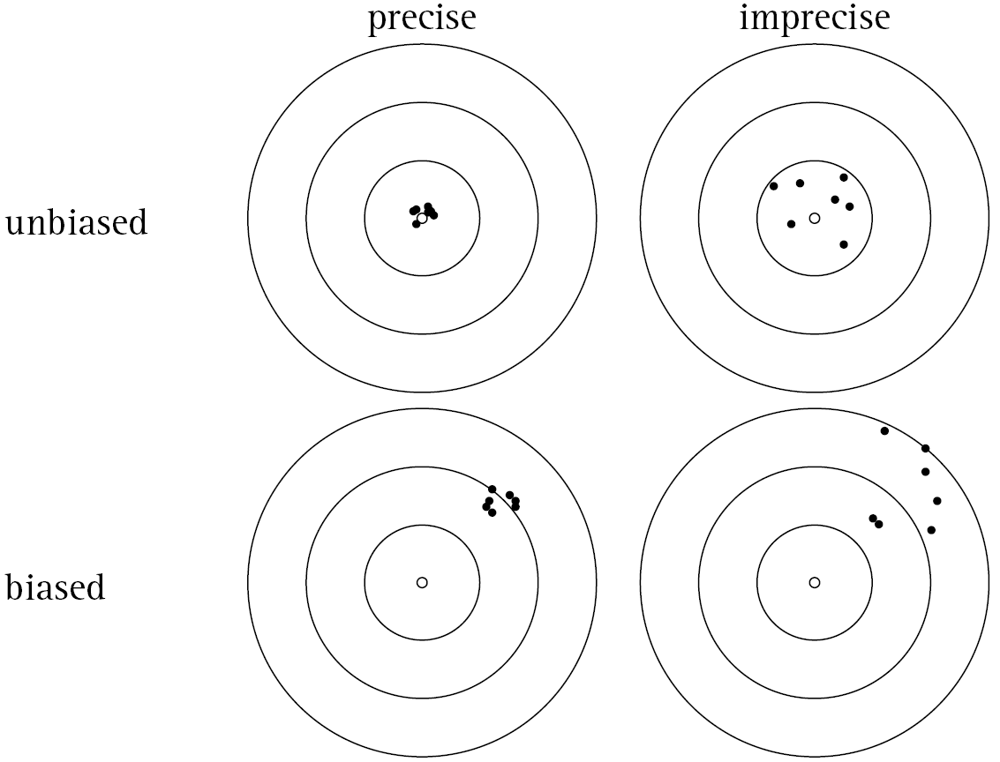

```{r, echo = FALSE, message=FALSE, warning = FALSE}
library(tidyverse)
```

\pagebreak

# 5.1 Introduction / Motivation

Often we're interested in multiple random variables and how they behave together. Some examples:

+ a biologist studying animal survival might be interested in the intersection of two events: the litter contains $n$ animals, and $y$ animals survive
+ height & weight of an individual is a pair of events relevant to height-weight measurements used in many health contexts 

Importantly for statisticians, when you take a random sample of size $n$, you end up with a sequence of random variables $Y_1, Y_2, \dots Y_n$. For example, this could represent the blood pressure of $n$ individuals, or $n$ different measurements for a single person. A specific set of outcomes, or sample measurements, can be expressed in terms of the intersection of the $n$ events $(Y_1 = y_1, Y_2 = y_2, \dots Y_n = y_n)$. Knowing the probability of this intersection is essential in making inferences about the population from which the sample is drawn. 

In chapters 3 & 4, we worked with **univariate** distributions that described the behavior of a single random variable. In Chapter 5, we will consider **bivariate** and **multivariate** distributions; that is, the joint behavior of 2 or more random variables. 

# 5.2 Bivariate and Multivariate Probability Distributions

## Joint probability mass functions (pmfs)

Suppose that you randomly select an email sent to your account and
record whether or not the email is spam, and whether it is sent as HTML or plain text. Let $S = 1$ if the email is spam and $S=0$ otherwise, and let $H = 1$ if the email is HTML and $H = 0$ otherwise. The proportion of the population of emails falling into each category of $S$ and $H$ is recorded in the table below.

|       | H = 0 | H = 1 |
|-------|-------|-------|
| S = 0 | 0.25  | 0.65  |
| S = 1 | 0.06  | 0.04  |

::: {.activitybox data-latex=""}
**Exercise:**

What is the probability that a randomly selected email is HTML & spam?

\

What is $P(S = 0, H = 0)$?

\

What is the probability that an email is spam?

\


:::

The table above gives the **joint pmf** of the random variables $S$ and $H$, where the cells of the table are the probabilities $p(s,h) = P(S = s, H=h)$.

::: {.highlightbox data-latex=""}
**Defintion 5.1/Theorem 5.1** Let $Y_1$ and $Y_2$ be two discrete random variables. The probability that
$Y_1 = y_1$ and $Y_2= y_2$ is denoted by $$p(y_1, y_2) = P(Y_1 = y_1, Y_2= y_2),$$ $-\infty < y_1 < \infty, -\infty < y_2 < \infty$. The
function $p(y_1, y_2)$ is called the
\textcolor{red}{\textbf{joint probability mass function (joint pmf)}} of
$Y_1$ and $Y_2$ and has the following properties:

1.  $0 \leq p(y_1, y_2) \leq 1.$
2.  $\mathop{\sum}_{(y_1, y_2) \in S} p(y_1, y_2) = 1,$
where the sum is over all pairs of values $(y_1, y_2)$ in the support $S$ (i.e. that have assigned non-zero probabilities)
:::

Note, you may also see notation that uses two random variables $X$ and $Y$ rather than $Y_1$ and $Y_2$. 

::: {.activitybox data-latex=""}
**Exercise (cont'd):**

Confirm that the joint pmf above for $S$ and $H$ is a valid pmf. 

\
\

:::

::: {.highlightbox data-latex=""}
**Definition 5.2:** For any random variables $Y_1$ and $Y_2$, the joint cumulative distribution function\* (cdf) is given by 

$$F(y_1, y_2) = P(Y_1\leq y_1, Y_2\leq y_2)$$ 
:::

\*Note, the book refers to this simply as the joint distribution function. 

For discrete random variables,

$$F(y_1, y_2) = \sum_{t_1 \leq y_1}\sum_{t_2 \leq y_2}p(t_1, t_2)$$

::: {.activitybox data-latex=""}

**Example**: Of 9 executives in a business, 4 are married, 3 have never married, and 2 are divorced. Three executives are to be selected for promotion. Let $Y_1$ denote the number of married executives and $Y_2$ denote the number of never married executives among the 3 selected for promotion. Assuming that the 3 are randomly selected from the 9 available, find the joint pmf of $Y_1$ and $Y_2$. 

\
\
\
\
\
\
\
\
\
\
\
:::

\pagebreak

Often we will deal with random variables $X$ and $Y$ whose joint pmf can be represented in functional form:

::: {.activitybox data-latex=""}
**Example:**

Let the joint pmf of $X$ and $Y$ be defined by:
$p\left(x,y\right)=\frac{x+y}{21},\ \ \ \ x=1,2,3,\ \ \ \ y=1,2$\
\
Represent the pmf as a graph/table\
\
\
\
\
\
\
\
\
\
\
\


Confirm this is a valid pmf

\
\
\
\
What is $P(X > Y)$?\
\
\
\
\
\
\
Find $F(2,2)$

\
\
\
\
\
\
\
\
\
:::

\pagebreak

## Joint pdfs

The ideas of bivariate distributions extend from discrete to continuous
by replacing sums with integrals.

::: {.highlightbox data-latex=""}
Two random variables are said to be jointly continuous if their joint distribution function $F(y_1,y_2)$ is continuous in both arguments. 

$$F(y_1, y_2) = \int_{-\infty}^{y_1}\int_{-\infty}^{y_2}f(t_1,t_2)dt_2dt_1$$ 

The function $f(y_1,y_2)$ is called the 
\textcolor{red}{\textbf{joint probability density function (joint pdf)}}
for two jointly continuous random variables and has properties:

1.  $f(y_1,y_2) \geq 0,$ for all $y_1,y_2$
2.  $\int_{-\infty}^{\infty}\int_{-\infty}^{\infty} f(y_1,y_2)dy_1dy_2 = 1.$
:::

+ Probabilities are found as volumes under the joint pdf
over regions of the support

### Reminder about double integrals

Evaluating double integrals amounts to evaluating the inner integral first, then the outer integral:

$$
\int\int f(x,y)dxdy = \int\left(\int f(x,y)dx\right)dy
$$

+ We can usually interchange the order of integration, but we must be careful about the appropriate bounds
+ If the bounds are a function of the variables (e.g. $0 < x < y< 1$), then the inner bounds should include the variable, and the outer bounds should be constants (not dependent on the variables).

$$\int_0^1\int_0^yf(x,y)dxdy = \int_0^1\int_x^1f(x,y)dydx$$

+ Draw a picture to determine the appropriate bounds of integration!


::: {.activitybox data-latex=""}
**Example** Suppose that a radioactive particle is randomly located in a square with sides of unit length. That is, if two regions within the unit square and of equal area are considered, the particle is equally likely to be in either region. Let $X$ and $Y$ denote the coordinates of the particle's location. A reasonable model for the relative frequency histogram for $X$ and $Y$ is the bivariate analog of the univariate uniform density function. 

$$f(x,y) = \begin{cases} 1, & 0 \leq x \leq 1, 0 \leq y \leq 1\\
0, & elsewhere
\end{cases}
$$

a. Sketch the probability density surface. 
b. Find $F(0.2, 0.4)$
c. Find $P(0.1 \leq X \leq 0.3, 0 \leq Y \leq 0.5)$
\
\
\
\
\
\
\
\
\
\
\
\

\
\
\
\
\
\
\
\
\
\
\
\
\
\
\
\
\
:::

::: {.activitybox data-latex=""}
**Example** Gasoline is stocked in a bulk tank once at the beginning of each week and then sold to individual customers. Let $X$ denote the proportion of capacity of the bulk tank that is full when the tank is stocked at the beginning of the week. Because of the limited supplies, $X$ varies from week to week. Let $Y$ denote the proportion of the capacity of the bulk tank that is sold during the week. Both are proportions, so are restricted between 0 and 1, and further, the amount sold $y$ cannot exceed the amount available $x$. Suppose that the joint density function for $X$ and $Y$ is given by:

$$
f(x,y) = 
\begin{cases}
3x, & 0 \leq y \leq x \leq 1 \\
0, & elsewhere
\end{cases}
$$

Find the probability that less than one-half of the tank will be stocked and more than one-quarter of the tank will be sold.

\
\
\
\
\

\
\
\
\
\
\
\
\
\
\
\
\
\
\
\
\
\
\
\
\
\
\

\
\
\
\
\
\
\
\
\
\

:::


# 5.3 Marginal and Conditional distributions

::: {.highlightbox data-latex=""}
**Definition 5.4a** <br/> Let $X$ and $Y$ have the joint probability
mass function $f(x, y)$ with support $S$. The probability mass function
of $X$ alone, which is called the
\textcolor{red}{\textbf{marginal probability mass function}} of $X$, is
defined by $$p_X(x) = \sum_y p(x,y) = P(X = x), \ \ \ \ \ x \in S_x,$$
where the summation is taken over all possible $y$ values for each given
$x$ in the support of $x$ $(S_x)$. That is, the summation is over all
$(x,y)$ in $S$ with a given $x$ value. Similarly, the
\textcolor{red}{\textbf{marginal probability mass function}} of $Y$, is
defined by $$p_Y(y) = \sum_x p(x,y) = P(Y = y), \ \ \ \ \ y \in S_y,$$
where the summation is taken over all possible $x$ values for each given
$y$ in the support of $y$ $(S_y)$.
:::

::: {.activitybox data-latex=""}
**Spam & HTML example continued:**

Find the marginal distributions of $S$ and $H$. Then confirm that they are valid pmfs.

|       | H = 0 | H = 1 |
|-------|-------|-------|
| S = 0 | 0.25  | 0.65  |
| S = 1 | 0.06  | 0.04  |

\
:::

::: {.activitybox data-latex=""}
**Example (cont'd):**

Returning to the example from 5.2 with
$$p\left(x,y\right)=\frac{x+y}{21},\ \ \ \ x=1,2,3,\ \ \ \ y=1,2$$

Find the marginal distributions $p_X(x)$ and $p_Y(y)$, once using the table and once using the summation notation ($\Sigma$).
\
\
\
\
\
\
\
\
\
\
\
\
\
:::

::: {.highlightbox data-latex=""}

**Definition 5.4b**:  Let $X$ and $Y$ be jointly continuous random variables with joint pdfs $f(x,y)$. Then the \textcolor{red}{\textbf{marginal probability density functions (marginal pdfs)}} are given by:
$$\begin{aligned}
f_x\left(x\right)&=\int_{-\infty}^{\infty}f\left(x,y\right)dy,\ \ \ \ x\in S_x, \\ 
f_y\left(y\right)&=\int_{-\infty}^{\infty}f\left(x,y\right)dx,\ \ \ \ y\in S_y
\end{aligned}$$ 

:::

+ Marginal pdf's are obtained by "integrating out" (or summing over) the
other variable


::: {.activitybox data-latex=""}
**Example (cont'd)** Return to the example from 5.2 and find the marginal distributions of $X$ and $Y$. Confirm that they are valid pdfs. 
$$
f(x,y) = 
\begin{cases}
3x, & 0 \leq y \leq x \leq 1 \\
0, & elsewhere
\end{cases}
$$
\
\
\
\
\
\
\
\
\
\
\
:::

## Conditional Distributions

Consider a population of students, each of whom have achievement test scores $Y$ and family income levels $W$. Suppose that we know the joint distribution of $Y,W$ in this population. In the absence of further information, the probability that a student randomly selected from this population has a test score higher than 1000 can be evaluated from the distribution function:

$$P(Y > 1000) =  \sum_{k>1000}P(Y = k)$$

Now suppose that we randomly select a student and learn that their family income level is \$80K per year. What is the probability that this student has a test score higher than 1000? To answer this question, we need conditional probability. Specifically, we need hold family income constant at \$80K, that is, to look at the distribution of test scores among the subset of the population of students with family incomes of exactly \$80K.

$$P(Y > 1000 | W = \$ 80k)$$

## Conditional Probability Mass Functions

::: {.highlightbox data-latex=""}
**Definition**:<br/> The
\textcolor{red}{\textbf{conditional probability mass function}} of $X$
given that $Y=y$, is defined by
$$p(x|y) = \frac{P(X = x, Y = y)}{P(Y=y)}=\frac{p(x,y)}{p_Y(y)}, \ \ \ \ p_Y(y)>0$$

Similarly the
\textcolor{red}{\textbf{conditional probability mass function}} of $Y$
given that $X=x$, is defined by
$$p(y|x) = \frac{P(X = x, Y = y)}{P(X=x)} = \frac{p(x,y)}{p_X(x)}, \ \ \ \ p_X(x)>0$$
:::

Note this comes from the definition of conditional probability. For
$A = \{X = x\}$ and $B = \{Y = y\},$ $p(x,y)$ gives $P(A\cap B)$ and
$$P(B|A) = \frac{P(A\cap B)}{P(A)}= \frac{p(x,y)}{p_X(x)}$$

::: {.activitybox data-latex=""}
**Example:**

Let $$p\left(x,y\right)=\frac{x+y}{21},\ \ \ \ x=1,2,3,\ \ \ \ y=1,2.$$
We previously found marginal pmf's:
$$p_x\left(x\right)=\frac{2x+3}{21},\ \ \ \ x=1,2,3,\ \ \ \ \text{and}\ \ \ p_y\left(y\right)=\frac{y+2}{7},\ \ \ \ y=1,2.$$

1.  Produce a table for the joint/marginal pmfs
2.  Find the conditional pmfs of $X$ given $Y = y$ and add a table for this
3.  Find the conditional pmfs of $Y$ given $X = x$ and add a table for this

\
\
\
\
\
\
\
\
\
\
\
\
\
\
\
\
\
\
\
\
:::

<!-- ::: {.activitybox data-latex=""} -->
<!-- **Example:** Let $X$ and $Y$ have a uniform distribution on the set of points with integer coordinates in -->
<!-- $S = \{(x, y) : 0 \leq x \leq 7, \ \ \ x \leq y \leq x+2\}$. That is, -->
<!-- $p(x,y) = 1/24, \ \ \ (x,y) \in S$, and both $x$ and $y$ are integers. Find: -->

<!-- 1.  $p_X(x)$ and $p_Y(y)$ -->
<!-- 2.  $p(y|x)$ -->
<!-- \ -->
<!-- \ -->
<!-- \ -->
<!-- \ -->
<!-- \ -->
<!-- \ -->
<!-- \ -->
<!-- \ -->
<!-- \ -->
<!-- \ -->
<!-- \ -->
<!-- \ -->
<!-- \ -->
<!-- \ -->
<!-- \ -->
<!-- \ -->
<!-- \ -->
<!-- \ -->
<!-- \ -->
<!-- \ -->
<!-- ::: -->

::: {.highlightbox data-latex=""}
**Definition 5.6**: If $X$ and $Y$ are jointly continuous random variables, the
\textcolor{red}{\textbf{conditional cumulative distribution function}} of $X$
given that $Y=y$, is defined by
$$F(x|y) = P(X \leq x | Y = y)$$
:::

::: {.highlightbox data-latex=""}
**Definition 5.7**: Let $X$ and $Y$ are jointly continuous random variables with joint pdf $f(x,y)$ and marginal pdfs $f_X(x)$ and $f_Y(y)$ respectively. For any $y$ such that $f_Y(y) > 0,$ the conditional density of $X$ given $Y = y$ is given by: 
$$f(x|y) = \frac{f(x,y)}{f_Y(y)}$$ and, for any $x$ such that $f_X(x) > 0,$ the conditional density of $Y$ given $X = x$ is given by: 
$$f(y|x) = \frac{f(x,y)}{f_X(x)}$$
:::

::: {.activitybox data-latex=""}
**Example**: A soft drink machine has a random amount $Y$ in supply at the beginning of a given day and dispenses a random amount $X$ during the day (with measurements in gallons). It is not resupplied during the day, and hence $X \leq Y$. It has been observed that $X$ and $Y$ have a joint pdf given by:
$$
f(x,y) = 
\begin{cases}
1/2, & 0 \leq x \leq y \leq 2 \\
0, & elsewhere
\end{cases}
$$
That is, the points $(x,y)$ are uniformly distributed over the triangle with the given boundaries.

+ Find the conditional pdf of $X$ given $Y = y$
+ Evaluate the probability that less than 1/2 gallon will be sold, given that the machine contains 1.5 gallons at the start of the day
\
\
\
\
\
\
\
\
\
\
\
\
\
\
\
\
\
\

:::

# 5.4 Independent Random Variables

::: {.highlightbox data-latex=""}
**Definition 5.8** Let $X$ have cdf $F_X(x)$, $Y$ have cdf $F_Y(y)$, and $X$ and $Y$ have joint cdf $F(x,y)$. Then $X$ and $Y$ are indpendent are said to be \textcolor{red}{\textbf{independent}} if any only if $$F(x,y) = F_X(x)F_Y(y)$$ for every pair of real numbers $(x,y)$. If $X$ and $Y$ are not independent, they are said to be *dependent*.
:::

::: {.highlightbox data-latex=""}
**Theorem 5.4** <br/> The **discrete** random variables with joint pmf $p(x,y)$ are \textcolor{red}{\textbf{independent}} if and only if, for every pair of real numbers,
$$P(X = x, Y = y) = P(X = x)P(Y = y)$$ or, equivalently,
$$p(x,y) = p_X(x)p_Y(y).$$

The **continuous** random variables with joint pdf $f(x,y)$ are \textcolor{red}{\textbf{independent}} if and only if, for
every pair of real numbers
$$f(x,y) = f_X(x)f_Y(y).$$
:::

::: {.activitybox data-latex=""}
**Example (cont'd):**

Continuing the same example as before with
$$p\left(x,y\right)=\frac{x+y}{21},\ \ \ \ x=1,2,3,\ \ \ \ y=1,2,\ \ \ \ p_X(x) = \frac{2x + 3}{21},\ \ \ \ p_Y(y) = \frac{2 + y}{7}$$

Are $X$ and $Y$ independent?\
\
\
\
\
:::

::: {.activitybox data-latex=""}
**Example** Let $$
f(x,y) = 
\begin{cases}
6xy^2, & 0 \leq x \leq 1,0 \leq y \leq 1 \\
0, & elsewhere
\end{cases}
$$
Show that $X$ and $Y$ are independent. 
\
\
\
\
\
\
\
:::

::: {.highlightbox data-latex=""}
**Theorem 5.5**: Let $X$ and $Y$ have a joint pdf $f(x,y)$ that is positive if and only if $a \leq x \leq b$ and $c \leq y \leq d$; and $f(x,y) = 0$ otherwise. Then $X$ and $Y$ are independent random variables if and only if $$f(x,y) = g(x)h(y),$$ where $g(x)$ is a function of $x$ alone and $h(y)$ is a function of $y$ alone.
:::

Notice, this means we don't actually have to derive the marginal pdfs of $x$ and $y$. Indeed, $g(x)$ and $h(y)$ need not be marginal densities (though they will be constant multiples of the marginal pdfs). 

In the previous example with $f(x,y) = 6xy^2,  0 \leq x \leq 1,0 \leq y \leq 1$, we have $x$ and $y$ bounded between two sets of constants (their bounds do not depend on each other), and we can write $f(x,y)$ as the product of $g(x) = 6x$ and $h(y) = y^2$. Thus, this is enough to say they are independent.

::: {.activitybox data-latex=""}
**Example**: Let $$
f(x,y) = 
\begin{cases}
2x, & 0 \leq x \leq 1,0 \leq y \leq 1 \\
0, & elsewhere
\end{cases}
$$
Are $X$ and $Y$ independent? 

\
\
\
\
\
\

:::

\pagebreak

# 5.5 Expected Value of a Function of Random Variables

::: {.highlightbox data-latex=""}
Let $g(Y_1, Y_2, \dots,Y_k)$ be a function of **discrete** random variables $Y_1, Y_2, \dots,Y_k$ that have joint pmf
$p(y_1, y_2, \dots, y_k)$. Then
$$E[g(Y_1, Y_2, \dots,Y_k)] = \sum_{\text{all }y_k} \cdots \sum_{\text{all }y_2}\sum_{\text{all }y_1} g(y_1, y_2, \dots, y_k)p(y_1, y_2, \dots, y_k).$$

If $Y_1, Y_2, \dots,Y_k$ are **continuous** random variables with joint pdf $f(y_1, y_2, \dots, y_k)$, then 

$$E[g(Y_1, Y_2, \dots,Y_k)] = \int_{-\infty}^{\infty}\cdots \int_{-\infty}^{\infty}\int_{-\infty}^{\infty}g(y_1, y_2, \dots, y_k)f(y_1, y_2, \dots, y_k)dy_1dy_2\dots dy_k$$
:::

::: {.activitybox data-latex=""}
**Exercise (cont'd):** Continuing the same example as before with
$$p\left(x,y\right)=\frac{x+y}{21},\ \ \ \ x=1,2,3,\ \ \ \ y=1,2$$

Find $E(XY^2)$ using the joint distribution.\
\
\
\
\
\
\
\
\
\
\
\
\
\
\
\
\
:::

::: {.activitybox data-latex=""}
**Example:** Let
$f\left(x,y\right)=2,\ \ \ \ 0 <  x <  y < 1$

1.  Find $P(0 < X < 1/2, 0 < Y < 1/2)$ *Hint: draw a picture to determine the bounds of integration*
2.  Find the marginal pdfs of $X$ and $Y$.
3.  Find the mean of $Y$ and the variance of $Y$
\
    \
    \
    \
    \
    \
    \
    \
    \
    \
    \
    \
    \
    \
    \
    \
    \
    \
    \
    \
    \
    \
    \
    \
    \
    \
    \
    \
    \
    \
    \
    \
    \
:::

\pagebreak

# 5.6: Special theorems

::: {.highlightbox data-latex=""}
**Theorem 5.6** Let $c$ be a constant. Then $E(c) = c$
:::

::: {.highlightbox data-latex=""}
**Theorem 5.7** Let $g(X,Y)$ be a function of the random variables $X$ and $Y$ and let $c$ be a constant. Then $E(cg(X,Y)) = cE(g(X,Y))$
:::

::: {.highlightbox data-latex=""}
**Theorem 5.8** Let $g_1(X,Y)$, $g_2(X,Y), \dots g_k(X,Y)$ be functions of the random variables $X$ and $Y$. Then $E\left[g_1(X,Y) + g_2(X,Y) + \dots + g_k(X,Y)\right] = E(g_1(X,Y)) + E(g_2(X,Y)) + \dots + E(g_k(X,Y))$
:::

**Example**: $E(2Y_1 + 3Y_2^2 - Y_3)$

::: {.highlightbox data-latex=""}
**Theorem 5.9** Let $X$ and $Y$ be independent random variables and $g(X)$ and $h(Y)$ be functions of $X$ and $Y$ only, respectively. Then $$E(g(X)h(Y)) = E(g(X))E(h(Y))$$ provided the expectations exist.
:::

# 5.7 The Correlation Coefficient

<!-- ## Expectation -->

<!-- Recall that for two discrete random variables $X$ and $Y$ -->
<!-- $$E(g(X,Y)) = \mathop{\sum\sum}_{(x,y) \in S} g(x,y)f(x,y).$$ Therefore, -->
<!-- we write $$\begin{aligned} -->
<!-- \mu_X &= E(X) = \mathop{\sum\sum}_{(x,y) \in S} xf(x,y) \\ -->
<!-- \mu_Y &= E(Y) = \mathop{\sum\sum}_{(x,y) \in S} yf(x,y) \\ -->
<!-- \sigma_X^2 &= E[(X - \mu_X)^2] = \mathop{\sum\sum}_{(x,y) \in S} (x - \mu_X)^2f(x,y) \\ -->
<!-- \sigma_Y^2 &= E[(Y - \mu_Y)^2] = \mathop{\sum\sum}_{(x,y) \in S} (y - \mu_Y)^2f(x,y)  -->
<!-- \end{aligned}$$ -->

<!-- ::: {.activitybox data-latex=""} -->
<!-- **Exercise:** -->

<!-- Re-write $\mu_X, \mu_Y, \sigma_X^2,\sigma_Y^2$ in terms of the marginal -->
<!-- pmfs.\ -->
<!-- \ -->
<!-- \ -->
<!-- \ -->
<!-- \ -->
<!-- \ -->
<!-- \ -->
<!-- \ -->
<!-- \ -->
<!-- \ -->
<!-- \ -->
<!-- \ -->
<!-- \ -->
<!-- \ -->
<!-- \ -->
<!-- \ -->
<!-- \ -->
<!-- \ -->
<!-- \ -->
<!-- \ -->
<!-- ::: -->

<!-- \pagebreak -->

## Covariance & Correlation

We now introduce the name of another special expectation:

::: {.highlightbox data-latex=""}
If $g(X,Y) = (X - \mu_X)(Y - \mu_Y),$ for two random variables $X$ and
$Y$ with means $\mu_X$ and $\mu_Y$ respectively, then

$$\sigma_{XY} \equiv Cov(X,Y) \equiv E(g(X,Y)) = E[(X -\mu_X)(Y-\mu_Y)]$$
is called the \textcolor{red}{\textbf{covariance}} of $X$ and $Y$.
<br/><br/> If the standard deviations $\sigma_X$ and $\sigma_Y$ are
non-zero, then
$$\rho_{XY} \equiv Cor(X,Y) = \frac{Cov(X,Y)}{\sigma_X\sigma_Y} = \frac{\sigma_{XY}}{\sigma_X\sigma_Y}$$
is called the \textcolor{red}{\textbf{correlation}} (or **correlation
coefficient**) of $X$ and $Y$.
:::

The **covariance** of two random variables is a measure of the linear dependence between the variables. Higher covariance indicates that one variable can be more strongly predicted by a linear function of the other variable. 

**Correlation** is a standardized version of the covariance. 

Guess the correlation applet: [https://www.geogebra.org/m/KE6JfuF9](https://www.geogebra.org/m/KE6JfuF9)

\pagebreak

## Graphically understanding Covariance and Correlation


\
\
\
\
\
\
\
\
\
\
\
\
\
\
\
\
\
\
\
\
\
\
\
\
\
\
\
\
\
\
\
\
\
Some important properties of Covariance:

::: {.highlightbox data-latex=""}

$$\text{Shortcut formula:   }Cov(X,Y) = E(XY) - \mu_X\mu_Y$$

:::

::: {.highlightbox data-latex=""}
$$Cov(X,X) = Var(X)$$
:::

::: {.highlightbox data-latex=""}

The variance of a sum of two random variables is equal to the sum of their variances and covariances: $$V(X + Y) = V(X) + V(Y) + 2Cov(X,Y)$$
:::

::: {.highlightbox data-latex=""}
If two random variables are independent, then their covariance is zero. However, zero covariance does NOT imply independence.
:::
\pagebreak


## Relationship to regression ("best fit") line

\pagebreak


::: {.activitybox data-latex=""}
**Example**: Roll a fair four sided die twice. Let $X$ equal the outcome of the first
roll and $Y$ the sum of the two rolls. Determine the covariance and correlation coefficient.

| $d_1 / d_2$ | 1 | 2 | 3 | 4 |
|----------------|---|---|---|---|
| 1 | (1,2) | (1,3) | (1,4) | (1,5) |
| 2 | (2,3) | (2,4) | (2,5) | (2,6) |
| 3 | (3,4) | (3,5) | (3,6) | (3,7) |
| 4 | (4,5) | (4,6) | (4,7) | (4,8) |

\
\
\
\
\
\
\
\
\
\
\
\
\
\
\
\
\
\
\
\
\
\
\
\
\
\
:::


::: {.activitybox data-latex=""}

**Example**: Let X, Y be two independent random variables. Show that $Cov(X,Y) = 0$.

\
\
\
\
\
\
\
\
:::

**Recall:** *independence $\implies Cov(X,Y) = 0$, but the converse is NOT true. It is possible to have $Cov(X,Y) = 0$ when $X$ and $Y$ are dependent.* 

# 5.8 Expected value and variance of linear functions of r.v's

::: {.highlightbox data-latex=""}
**Theorem 5.12** <br/>
Let $Y_1, Y_2, \dots Y_n$ and $X_1, X_2, \dots X_m$ be random variables with $E(Y_i) = \mu_i$ and $E(X_j) = \xi_j$. Define $$U_1 = \sum_{i = 1}^na_iY_i \ \ \  \text{ and }  \ \ \ U_2 = \sum_{j = 1}^mb_jX_j$$
for constants $a_1, a_2, \dots a_n$ and $b_1, b_2, \dots b_m$. Then the following hold: 

(a) $E(U_1) = \sum_{i = 1}^n a_i\mu_i$
(b) $V(U_1) = \sum_{i = 1}^n a^2_iV(Y_i) + 2\sum \sum_{1 \leq i \leq j \leq n}a_ia_jCov(Y_i, Y_j),$ where the double sum os over all pairs $(i,j)$ with $i< j$
(c) $Cov(U_1, U_2) = \sum_{i = 1}^n\sum_{j = 1}^mCov(Y_i,X_j)$
:::

Note, when $n = 2$, (b) is simply $V(a_1Y_1 + a_2Y_2) = a_1^2V(Y_1) + a_2^2V(Y_2) + 2a_1a_2Cov(Y_1,Y_2)$ 

::: {.activitybox data-latex=""}

**Example**: Let $Y_1$ and $Y_2$ be random variables with means $\mu_1$, $\mu_2$, variances $\sigma^2_1$, $\sigma^2_2$, and covariance $\sigma_{12}$ respectively. Suppose $U = 2Y_1 + 3Y_2$. Find $E(U)$ and $V(U)$. 
\
\
\
\
\
\
:::

::: {.activitybox data-latex=""}

**Example:**

Let the independent random variables $X_1$ and $X_2$ have respective means $\mu_1 = -4$ and $\mu_2 = 3$ and variances $\sigma_1^2 = 4$ and $\sigma_2^2 = 9$. Find the mean and variance of $Y = 3X_1 - 2X_2$.
\
\
\
\
\
\
\
\
\
\

If $X_3$ is a third random variable that has the same mean and variance as $X_2$ but is correlated with $X_1$ by the amount $\rho = 0.3$, what is the mean and variance of $W = 3X_1 - 2X_3$? 
\
\
\
\
\
\
\
\
\
\
:::

\pagebreak

::: {.activitybox data-latex=""}
**Example** In the 5.2 gasoline example, we were interested in $X$ and $Y$ that had the joint and marginal pdfs below:

$$f(x,y) = 3x, \ \ \ 0 \leq y \leq x \leq 1$$
$$f_x(x) = 3x^2, \ \ \ 0 \leq x \leq 1$$
$$f_y(y) = 3/2(1 - y^2), \ \ \ 0 \leq y \leq 1$$

Supposed we are interested in $W = X - Y$, which in context represents the proportional amount of gasoline remaining at the end of the week. Find the mean and variance of $W$. 

\
\
\
\
\
\
\
\
\
\
\
\
\
\
\
\
\
\
\
\
\
\
\
\
\
\
\
\
\
\
\
\


:::

\pagebreak
## Sample statistics

::: {.highlightbox data-latex=""}
Any function of the sample observations $X_1, X_2, \dots X_n$ is called a **statistic**

The **sample mean** of a random sample $X_1, X_2, \dots X_n$ is given by 

$$\overline{X} = \frac{X_1 + X_2 + \dots X_n}{n}$$
and the **sample variance** is given by $$S^2 = \frac{1}{n-1}\sum_{i =1}^{n}(X_i - \overline{X})^2$$

:::


$\overline{X}$ and $S^2$ are two examples of **statistics**. We will see that $\overline{X}$ is an **unbiased estimator** for the population mean $\mu$ and $S^2$ is an **unbiased estimator** for the population variance $\sigma^2$

```{r, echo = FALSE, fig.align="center", out.width="60%"}

```


::: {.activitybox data-latex=""}

When $X_1, X_2, \dots X_n$ are independent random variables with mean $\mu$ and variance $\sigma^2$, find the mean and variance of $\overline{X}$.

\
\
\
\
\
\
\
\
\

:::

\pagebreak

# 5.9 The Multinomial Probability Distribution

Recall a binomial random variable results from an experiment with $n$ trials, with two possible outcomes per trial (success/failure). Sometimes, we're interested in situations where there are more than 2 outcomes per trial. For example, there are at least 4 possible blood types a person can have. 

A **multinomial experiment** is a generalization of the binomial experiment.

::: {.highlightbox data-latex=""}
A **multinomial experiment** possesses the following properties:

1. The experiment consists of $n$ identical trials
2. The outcome of each trial falls into one of $k$ classes or cells
3. THe probability that the outcomes of a single trial falls into cell $i$ is $p_i,$ $i = 1, 2, \dots k$ and remains the same from trial to trial. Notice $p_1 + p_2 + \dots p_k = 1$
4. The trials are independent
5. The random variables of interest are $Y_1, Y_2, \dots Y_k$ where $Y_i$ equals the number of trials for which the outcome falls into cell $i$. Notice that $Y_1 + Y_2+ \cdots + Y_k = n$

:::

::: {.highlightbox data-latex=""}
The joint pmf for $Y_1, Y_2, \dots Y_k$ is given by

$$p(y_1, y_2, \dots y_k) = \frac{n!}{y_1!y_2!\cdots y_k!}p_1^{y_1}p_2^{y_2}\cdots p_k^{y_k},$$

where $\sum_{i = 1}^k p_i = 1$ and $\sum_{i = 1}^k y_i = n$

:::

::: {.activitybox data-latex=""}
According to recent census figures, the proportions of adults (persons over 18 years of age) in the United States associated with five age catgories are as given in the following table.

| Age | Proportion |
|-----|-----------|
| 18-24 | 0.18|
| 25 - 34 | 0.23 |
| 35 - 44 | 0.16 | 
| 45 - 64 | 0.27 |
| 65+ | 0.16| 

If these figures are accurate and five adults are randomly sampled, find the probability that the sample contains one person between ages of 18 and 24, two between the ages of 25 and 34, and two between the ages of 45 and 64. 

\
\
\
\
\
\
\
\
\
\


:::

::: {.highlightbox data-latex=""}

**Theorem 5.13** If $Y_1, Y_2, \dots Y_k$ have a multinomial distribution with parameters $n$ and $p_1, p_2, \dots p_k$, then 

1. $E(Y_i) = np_i$
2. $V(Y_i) = np_iq_i$
3. $Cov(Y_s, Y_t) = -np_sp_t$ if $s \neq t$

:::

\pagebreak

# 5.11 Conditional Expectation

Conditional distributions can be used to computed probabilities and
expected values just as with any distribution.

::: {.highlightbox data-latex=""}

**Definition 5.13** If $X$ and $Y$ are any two random variables, the *conditional expectation of $g(X)$ given that $Y = y$, is defined to be

$$E(g(X) | Y = y) = \int_{-\infty}^{\infty}g(x)f(x|y)dx$$ if $X$ and $Y$ are jointly continuous, and 
$$E(g(X) | Y = y) = \sum_{x}g(x)p(x|y)$$ if $X$ and $Y$ are jointly discrete.

:::

::: {.activitybox data-latex=""}
Refer back to our example in 5.3 with $f(x,y) = 1/2, 0 \leq x \leq y \leq 2$, where we found $f(x | y) = 1/y, \ \ \ 0 < x \leq y$. Find the conditional expectation of the amount of sales, $X$, given that $Y = 1.5$.
\
\
\
\
\

\
\
\

:::

::: {.highlightbox data-latex=""}
**Theorem 5.14** Let $X$ and $Y$ denote random variables. Then $$E(X) = E[E(X | Y)],$$ where on the right-hand side the inner expectation is with respect to the conditional distribution of $X|Y$ and the outside expectation is with respect to the distribution of $Y$. 

:::
PROOF

\
\
\
\
\
\
\


::: {.highlightbox data-latex=""}

The conditional variance of $X$ given $Y$ is defined by 

$$V(X | Y = y) = E(X^2|Y = y) - [E(X | Y = y)]^2$$

:::

::: {.highlightbox data-latex=""}
**Theorem 5.15** Let $X$ and $Y$ denote random variables. Then 

$$V(X) = E[V(X|Y)] + V[E(X|Y)]$$

:::

PROOF:

\
\
\
\
\
\
\
\
\
\
\
\
\
\
\
\
\
\

::: {.activitybox data-latex=""}

A quality control plan for an assembly line involves sampling $n = 10$ finished items per day and counting $Y$, the number of defectives. If $p$ denotes the probability of observing a defective, then $Y$ has a binomial distribution, assuming that a large number of items are produced by the line. But $p$ varies from day to day and is assumed to have a uniform distribution on the interval from 0 to 1/4. Find the expected value and variance of $Y$.
\
\
\
\
\
\
\
\
\
\
\
\
\
\
\
\
\
\
\
\
\
\
\
\
\
\
\
\
:::

\pagebreak

# Chapter 5 Group Work

### Problem 1

Suppose that you randomly select a student from a large population of 4th grade students and record the student's sex and number of siblings. Let M = 1 if the selected student is male and M = 0 if the selected student is female. Let S record the student's number of siblings. The proportion of the population of students falling into each category of M and S is recorded in the table below.

| \# of siblings: | 0   | 1   | 2   | 3   | 4   |
|-----------------|-----|-----|-----|-----|-----|
| Female          | .10 | .18 | .12 | .07 | .04 |
| Male            | .12 | .18 | .14 | .03 | .02 |

a. Verify that the above table is a valid joint pmf.
b. Find the probability that the randomly selected student will be male with two siblings
c. Find $P(M = 0, S \leq 2)$
d. Find the probability that the randomly selected student will be an only child
e. Find $F(1,1)$

### Problem 2

Let $Y_1$ and $Y_2$ have the joint pdf 

$$f(y_1,y_2) = \begin{cases} e^{-(y_1 + y_2)}, & y_1 > 0, y_2 > 0\\
0, & elsewhere
\end{cases}
$$

a. What is $P(Y_1 < 1, Y_2 > 5)$?
b. What is $P(Y_1  + Y_2 < 3)$?


### Problem 3

Return to the scenario in Problem 1. 

a. Find the marginal distribution of $M$
b. Find the marginal distribution of $S$
c. Find $P(S \leq 2 | M = 1)$
d. Find $P(M = 1 | S \leq 2)$

### Problem 4

Let
$f\left(x,y\right)=\frac{4}{3}\left(1-xy\right),\ \ \ \ 0\le x\le1,\ \ \ \ 0\le y\le1.$

a.  Find the marginal pdfs of $X$ and $Y$.
b.  Find $P(X \leq Y/2)$
<!-- 2.  Find the mean of $X$ and the mean of $Y$ -->

### Problem 5

Let the joint pmf of $X$ and $Y$ be $$p\left(x,y\right)=\frac{xy^2}{30},\ \ \ x=1,2,3,\ \ \ \ y=1,2$$

a.  What are the marginal distributions of $X$ and $Y$?
b.  Are X and Y independent?
c.  What is $P(X > 1)$?
d.  What is $E(X)$?

### Problem 6

Let $X$ and $Y$ be two continuous random variables with joint pdf $f(x,y) = \frac{3}{16}xy^2, \ \ \ \ 0 \leq x \leq 2, \ \ 0 \leq y \leq 2$. Are the two random variables independent?

### Problem 7

Let $X$ and $Y$ have the joint pdf $f(x,y) = x + y, 0 \leq x \leq 1, 0 \leq y \leq 1$. Find the marginal pdfs $f_X(x)$ and $f_Y(y)$ and show that $X$ and $Y$ are dependent.


### Problem 8 

Let $Y_1, Y_2, Y_3$ be independent random variables with binomial distributions $b(4, 1/2), \ b(6,1/3), \text{ and } b(12,1/6)$.

a. Find $E(Y_1Y_2Y_3)$
a. Find the mean and variance of $W = Y_1+ Y_2+ Y_3$.

### Problem 9

Show that $Cov(X,Y) = E(XY) - \mu_X\mu_Y$. 

> *Hint: start with the definition $Cov(X,Y) = E[(X - \mu_X)(Y-\mu_Y)]$*

### Problem 10

Show that $E(XY) = \mu_X\mu_Y + \rho_{XY}\sigma_X\sigma_Y$ 

### Problem 11

Show that if two random variables $X$ and $Y$ are independent, then their covariance is 0. 

> *Hint: start with the shortcut formula $Cov(X,Y) = E(XY) - \mu_X\mu_Y$ and re-write $E(XY)$ as a double sum.*

### Problem 12

Return to the scenario in Problem 1 & 3. 

a. Are $M$ and $S$ independent?
a. Find $E(M)$ and $V(M)$
a. Find $Cov(M,S)$
a. Suppose that instead of just one student, you sample 12 students. Let $S_1, \dots S_{12}$ represent the number of siblings reported by each student (you can assume that these random variables are independent). Let $\overline{S} = \sum_{i = 1}^{12} \frac{S_i}{12}$ be the average number of siblings in the sample. Find $E(\overline{S})$ and $V(\overline{S})$

### Problem 13

Show that for any constants $a$ and $b$, $Cov(a + X, b + Y) = Cov(X,Y)$. That is, shifting by a constant does not change the covariance. *Note: this fact will be useful on HW 5.110*

### Problem 14

To estimate a proportion of units that meet a given criteria, we often use the estimator $\hat{p} = \frac{Y}{n},$ where $Y \sim binomial(n, p)$. Find the expected value and variance of $\hat{p}$, assuming n is fixed.

### Problem 15

A learning experiment requires a rat to run a maze (a network of pathways) until it locates one of three possible exits. Exit 1 presents a reward of food, but exits 2 and 3 do not. (If the rat eventually selects exit 1 almost every time, learning may have taken place). Let $Y_i$ denote the number of times exit $i$ is chosen in successive runnings. For the following, assume that the rate chooses an exit at random on each run. 

a. Find the probability that $n = 6$ runs result in $Y_1 = 3$, $Y_2 = 1$ and $Y_3 = 2$.
b. For general $n$, find $E(Y_1)$ and $V(Y_1)$.
c. For general $n$, find $Cov(Y_2, Y_3)$
d. To check for the fat's preference between exits 2 and 3, we may look at $Y_2 - Y_3$. Find $E(Y_2 - Y_3)$ and $V(Y_2 - Y_3)$ for general $n$.

### Problem 16

The number of defects per yard in a certain fabric, $Y$, is known to have a Poisson distribution with parameter $\lambda$. The parameter $\lambda$ is assumed to be a random variable with a pdf given by $$f(\lambda) = e^{-\lambda}, \ \ \ \lambda \geq 0$$

a. Find the expected number of defects per yard by first finding the conditional expectation of $Y$ for given $\lambda$.
b. Find the variance of $Y$.

