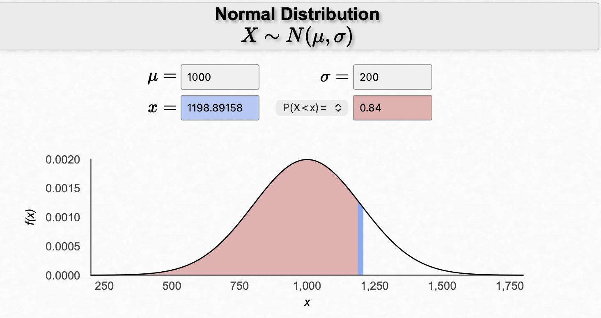

```{r, echo = FALSE, warning = FALSE, message = FALSE}
library(tidyverse)
library(distributional)
library(ggdist)
```

## 1. R Distribution Naming Pattern

All probability distributions in R follow the same structure. Once you understand the pattern, you can use any distribution.

| Prefix | Meaning                              | Example              |
|--------|--------------------------------------|----------------------|
| `d_`   | Density (height of curve)            | `dnorm(x, mean, sd)` |
| `p_`   | Probability P(X \< x)                | `pnorm(x, mean, sd)` |
| `q_`   | Quantile / percentile (cutoff value) | `qnorm(p, mean, sd)` |
| `r_`   | Random simulation                    | `rnorm(n, mean, sd)` |

## 2. Computing Probabilities

`p_` functions return cumulative probabilities:

$$F(x) = P(X < x)$$

| Distribution | Probability Function       | Connection to textbook parametrization |
|---------|-----------------|---------------| 
| Normal       | `pnorm(x, mean, sd)`       | $\mu, \sigma$
| Uniform      | `punif(x, min, max)`       | $\theta_1, \theta_2$
| Exponential  | `pexp(x, rate)`            | `rate` = $\lambda = 1/\beta$
| Gamma        | `pgamma(x, shape, rate)`  | `shape` = $\alpha$, `rate` = $\lambda = 1/\beta$
| Chi-square   | `pchisq(x, df)`            | $\nu$
| Beta         | `pbeta(x, shape1, shape2)` | $\alpha, \beta$

\pagebreak 

### Common Probability Patterns / Tasks

| Goal           | R code pattern                                       |
|----------------|------------------------------------------------------|
| $P(X < x)$     | `p_(x, ...)`                                         |
| $P(X > x)$     | `1 - p_(x, ...)` OR `p_(x, ..., lower.tail = FALSE)` |
| $P(a < X < b)$ | `p_(b, ...) - p_(a, ...)`                            |

By default R gives you the LOWER tail probability (to the left of a cutoff, $P(X < x)$). If you want the upper tail probability $P(X > x)$, you have to do 1 minus the lower tail or add the argument `lower.tail = FALSE` inside the function.

## 4. Finding Percentiles (Cutoffs)

Use the q\_() functions.

They find x such that:

$$P(X < x) = p$$

Example: `qnorm(.84, 1000, 200)` returns the 84th percentile for a normal distribution with mean $\mu = 1000$ and standard deviation $\sigma = 200$.

```{r}
qnorm(.84, 1000, 200)
```

{width="464"}

Note, the `p_()` and `q_()` functions are inverses.

```{r}
pnorm(1198.89158, 1000, 200)
```


