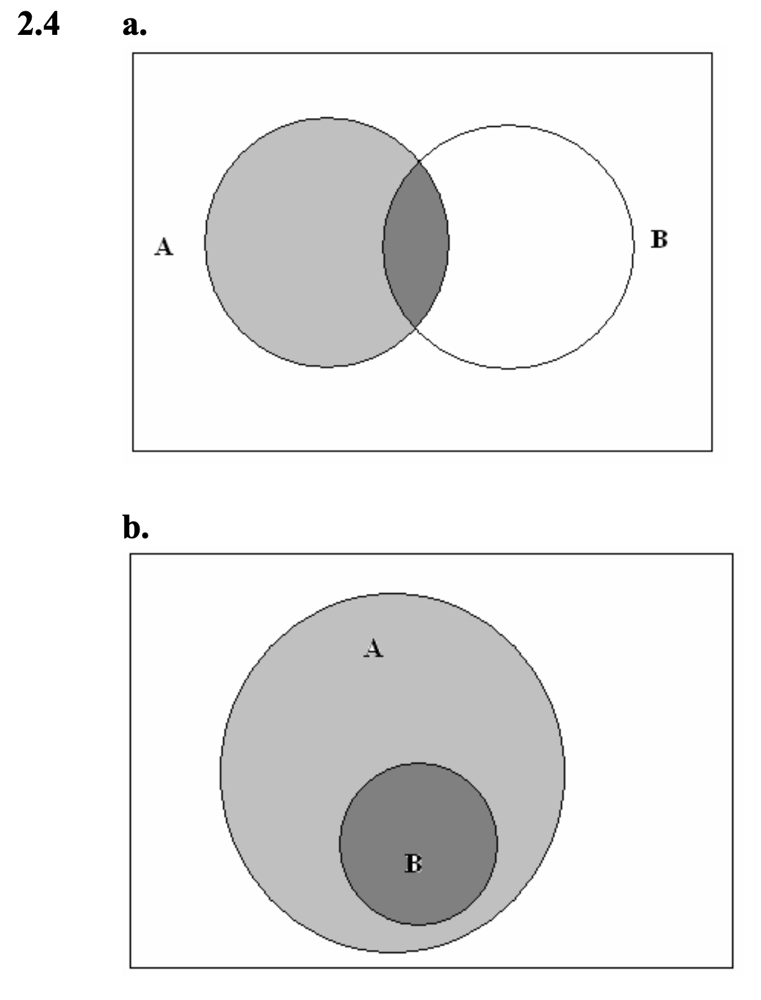

# Practice Problems 

## 2.1

$A = \{FF\}, \; B = \{MM\}, \; C = \{MF, FM, MM\}. \;
A \cap B = \varnothing, \;
B \cap C = \{MM\}, \;
C \setminus B = \{MF, FM\}, \;
A \cup B = \{FF, MM\}, \;
A \cup C = S, \;
B \cup C = C.$

## 2.9

$S = \{A^+, B^+, AB^+, O^+, A^-, B^-, AB^-, O^-\}$

## 2.15

a. Since the events are mutually exclusive,  
$P(S) = P(E_1) + \dots + P(E_4) = 1$.  
So, $P(E_2) = 1 - 0.01 - 0.09 - 0.81 = 0.09$.  

b. $P(\text{at least one hit}) = P(E_1) + P(E_2) + P(E_3) = 0.19$.

## 2.17

Let $B =$ bushing defect, $SH =$ shaft defect.  

a. $P(B) = 0.06 + 0.02 = 0.08$  

b. $P(B \text{ or } SH) = 0.06 + 0.08 + 0.02 = 0.16$  

c. $P(\text{exactly one defect}) = 0.06 + 0.08 = 0.14$  

d. $P(\text{neither defect}) = 1 - P(B \text{ or } SH) = 1 - 0.16 = 0.84$

## 2.19

a. $(V_1,V_1), (V_1,V_2), (V_1,V_3), (V_2,V_1), (V_2,V_2), (V_2,V_3), (V_3,V_1), (V_3,V_2), (V_3,V_3)$  

b. If equally likely, all have probability $1/9$.  

c. $A = \{\text{same vendor gets both}\} = \{(V_1,V_1), (V_2,V_2), (V_3,V_3)\}$  
$B = \{\text{at least one } V_2\} = \{(V_1,V_2), (V_2,V_1), (V_2,V_2), (V_2,V_3), (V_3,V_2)\}$  So, $P(A) = 1/3$, $P(B) = 5/9$,  
$P(A \cup B) = 7/9$, $P(A \cap B) = 1/9$.

## 2.25

Unless exactly $1/2$ of all cars in the lot are Volkswagens, the claim is not true.

## 2.31

a. There are four “good” systems and two “defective” systems.  
If two out of the six systems are chosen randomly, there are 15 possible unique pairs. Denoting the systems as $g_1, g_2, g_3, g_4, d_1, d_2$, the sample space is  $S = \{g_1g_2, g_1g_3, g_1g_4, g_1d_1, g_1d_2, g_2g_3, g_2g_4, g_2d_1, g_2d_2, g_3g_4, g_3d_1, g_3d_2, g_4g_1, g_4d_1, d_1d_2\}.$  Thus:  $P(\text{at least one defective}) = 9/15$,  $P(\text{both defective}) = P(d_1d_2) = 1/15$.  

b. If four are defective:  $P(\text{at least one defective}) = 14/15$, $P(\text{both defective}) = 6/15$.

# Submission Problems

## 2.4

{width="220"}

## 2.8

a. $36 + 6 = 42$  
b. $33$  
c. $18$

## 2.14

a. $P(\text{needs glasses}) = 0.44 + 0.14 = 0.48$  

b. $P(\text{needs glasses but doesn’t use them}) = 0.14$  

c. $P(\text{uses glasses}) = 0.44 + 0.02 = 0.46$

## 2.26

a. Let $N_1, N_2$ denote the empty cans and $W_1, W_2$ denote the cans filled with water.  
Thus, $S = \{N_1N_2, N_1W_2, N_2W_2, N_1W_1, N_2W_1, W_1W_2\}$.  

b. If this is merely a guess, the events are equally likely.  
So, $P(W_1W_2) = 1/6$.

## 2.28

a. Denote the four candidates as $A_1, A_2, A_3,$ and $M$.  
Since order is not important, the outcomes are  
$\{A_1A_2, A_1A_3, A_1M, A_2A_3, A_2M, A_3M\}$.  

b. Assuming equally likely outcomes, all have probability $1/6$.  

c. $P(\text{minority hired}) = P(A_1M) + P(A_2M) + P(A_3M) = 0.5$

## 2.30

a. Let $w_1$ denote the first wine, $w_2$ the second, and $w_3$ the third.  
Each sample point is an ordered triple indicating the ranking.  

b. Triples:  
$(w_1,w_2,w_3), (w_1,w_3,w_2), (w_2,w_1,w_3), (w_2,w_3,w_1), (w_3,w_1,w_2), (w_3,w_2,w_1)$  

c. For each wine, there are 4 ordered triples where it is not last.  
So, the probability is $2/3$.

## Additional Problem

Show that 

a) $P(A_1 \cup A_2) \leq P(A_1) + P(A_2)$

a) $P(A_1 \cap A_2) \geq P(A_1) + P(A_2) - 1$

### Solution

Both parts follow from the fact that $P(A_1 \cup A_2) = P(A_1) + P(A_2) - P(A_1 \cap A_2).$ 

#### Part a

$P(A_1 \cup A_2) = P(A_1) + P(A_2) - P(A_1 \cap A_2) \leq P(A_1) + P(A_2)$ because $P(A_1 \cap A_2) \geq 0$. 

#### Part b 

$P(A_1 \cup A_2) \leq 1 \implies P(A_1) + P(A_2) - P(A_1 \cap A_2) \leq 1 \implies P(A_1) + P(A_2) - 1 \leq P(A_1 \cap A_2)$

<!-- # 2.8 -->

<!-- For ease, the pair (1,2) is simply written as 12; (5,6) is written as 56, etc. -->

<!-- -   $A = \{12,22,32,42,52,62,14,24,34,44,54,65,16,26,36,46,56,66\}$ -->

<!-- -   $C' = \{22,24,26,42,44,46\}$ -->

<!-- -   $A \cap B = \{22,24,26,42,44,46,62,64,66\}$ -->

<!-- -   $A \cap B' = \{12,14,16,32,34,36,52,54,56\}$ -->

<!-- -   $A' \cup B = \{11,21,31,41,51,61,13,23,33,43,53,63,15,25,35,45,55,65,22,42,62,24,44,64,26,46,66\}$ -->

<!-- -   $A' \cap C= \emptyset$ -->
